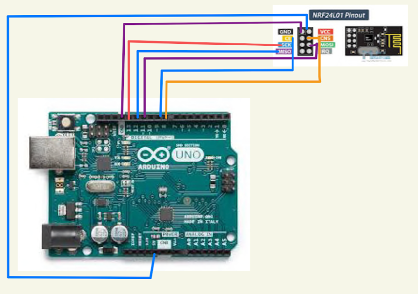

# RoboCup SSL interface & Communication

This repository is made for assisting WSU Robocup team for Raspberry and Arduino connection and set up for radio communication

**Arduino NRf24l01 connection**

SPI pins differ depending on Arduino type.  

| Arduino | SCK | MISO | MOSI | SS |
|-------- | --- | ---- | ---- | -- | 
| Uno | 13 | 12 | 11 | 10 |
| Nano | 13 | 12 | 11 | 10|
| Mega | 52 | 50 | 51 | 53|

